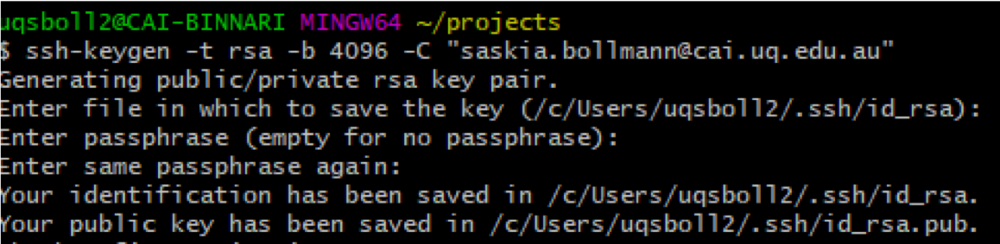
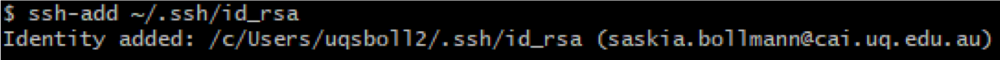
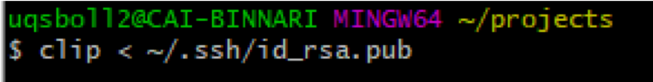
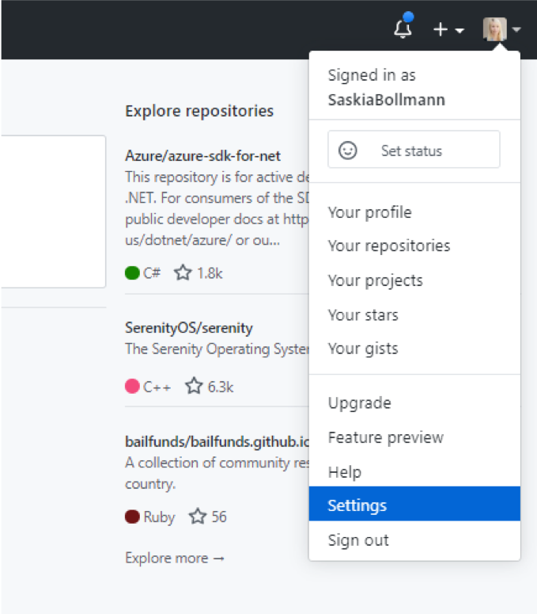
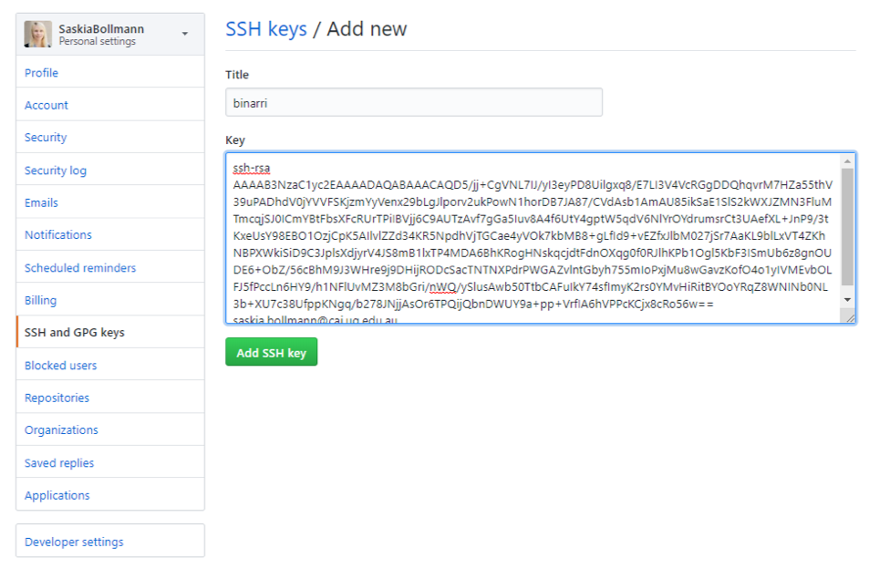

# Introduction to Git course

## Pre-requisites for the course

 - sign up for a [github.com account](https://github.com/) and make sure you remember the password to sign in
 - make sure that git is installed on your machine.  You can check this by typing 

```
git -- version
```
## Git
### What is git?

Git is a version control system that allows you to track and save changes to your projects, files, code etc by taking annotated, reversible snapshots of your repositories.


## Git on Github.com

### Organisation of Github
Git is organized in repositories. You can create, commit into and annoate into repositories right on github.

## Concepts

### .gitignore
The .gitignore file includes all files that are not being tracked. 

### readme.md
###  contributing.md

# Creating ssh keys

Type the following in your terminal to create a new ssh key pair


add the key pair to your .ssh file:


copy the public(!) part of the pair


Add public(!) key to git hub:

<!--- 


--->
# Git on the command line

## Commands

### show the status of the working tree
```
git status
```
### show local changes
``` 
git diff
```
Go back from `git  diff` by trying `q`
### staging
```
git add file
```
### committing
```
git commit -m "my commit"
```
### staging  and committing
```
git commit -a -m "Intro to git"
```
### push to remote (publish)
```
git push
```
### branches 
#### new branch and publish it to remote
```
git checkout -b dev
git push -u origin dev
```

## Git via GUIs

### VScode

### Github Desktob

## Best practices

1. You should have at least two branches: *main* and *dev*. 


## Merge conflicts

